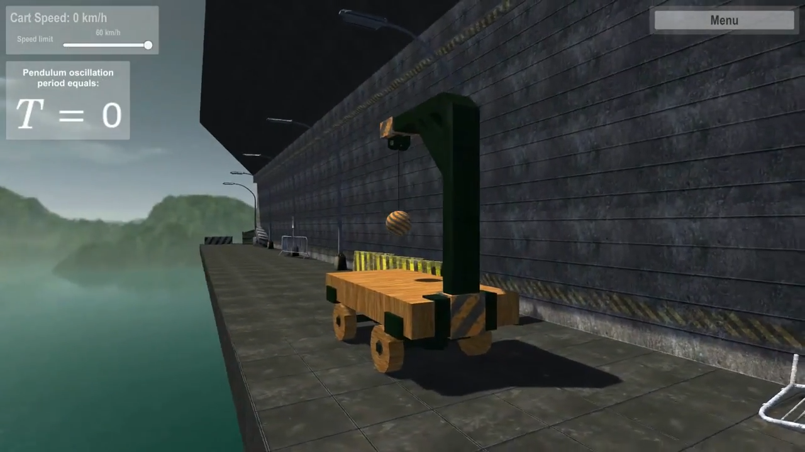
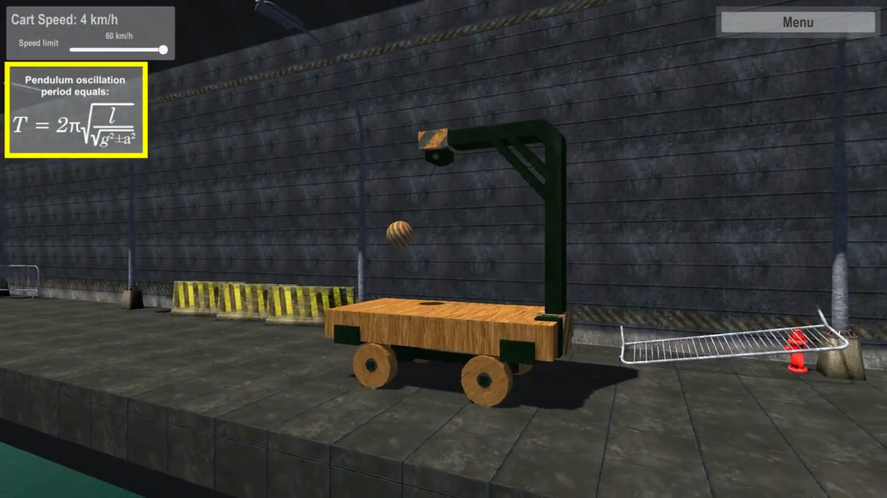

&nbsp;

## Description

This is a second module of Demonstrations of Physics Phenomena app. As in the first part, you can inspect available physics phenomenas in the 3D virtual world, tweak various buttons, slide bars and other UI widgets to change a phenomena properties or directly modify properties of it's surrounding environment. This application was developed to support theory lessons with visuals and ultimately make physics classes more entertaining and engaging for students.

Application is built on Unity3D, app logic is written in C#. Visuals have been created in 3DS MAX and are available as FBX models along with the app source code in this repo. This application also has [first module](https://github.com/arkadyt/phys-bund)!

This bundle of demonstrations includes:
* Station that allows to review swing, free-fall, and other forces affecting a pendulum attached to a movable cart with controllable speed and acceleration.
* Same setup but installed into a vertical elevator with controllable speed and direction.

[Youtube Video](https://youtube.com/watch?v=EQC8qWGbsG8).
[Project code](https://github.com/arkadyt/phys-pend/tree/master/Assets/Scripts).

## Download

Windows (x64): [Part 1](https://github.com/arkadyt/phys-pend/raw/master/Build.part1.rar), [Part 2](https://github.com/arkadyt/phys-pend/raw/master/Build.part1.rar).

## License

```
The GNU General Public License v3.0 (GPLv3)

Copyright (C) 2020 Andrew Titenko

This program is free software: you can redistribute it and/or modify
it under the terms of the GNU General Public License as published by
the Free Software Foundation, either version 3 of the License, or
(at your option) any later version.

This program is distributed in the hope that it will be useful,
but WITHOUT ANY WARRANTY; without even the implied warranty of
MERCHANTABILITY or FITNESS FOR A PARTICULAR PURPOSE.  See the
GNU General Public License for more details.

You should have received a copy of the GNU General Public License
along with this program.  If not, see https://www.gnu.org/licenses/gpl-3.0.html.
```
